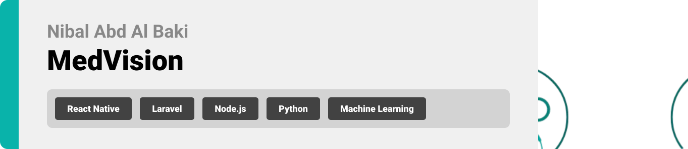

#MedVision

  

<!-- project philosophy -->

> MedVision aims to streamline the medical imaging analysis process by providing a user-friendly platform for doctors to upload, process, and analyze CT scans. We believe in enhancing the diagnostic experience by saving time, improving accuracy, and ensuring comprehensive patient care.

### User Stories

## Doctor
 
- As a doctor, I want to upload CT scans and use machine learning to detect cancer so that I can efficiently diagnose my patients.
-As a doctor, I want to view and manage my daily and weekly schedule so that I can keep track of my appointments and plan my day.
-As a doctor, I want to live chat with other doctors and patients so that I can collaborate with colleagues and communicate with patients in real time.

## Patient

- As a patient, I want to request an appointment with a doctor so that I can receive medical attention when needed.
-As a patient, I want to view the medical report uploaded by my doctor so that I can understand the results of my diagnosis.
-As a patient, I want to live chat with my doctor so that I can ask questions and get updates about my health in real time.

## Admin

- As an admin, I want to view a summary chart that displays statistics about doctors and patients so that I can monitor the overall activity of the platform.
- As an admin, I want to manage doctor and patient information so that I can keep the system updated and accurate.
- As an admin, I want to edit or delete user accounts so that I can maintain control over who can access the platform.

  
