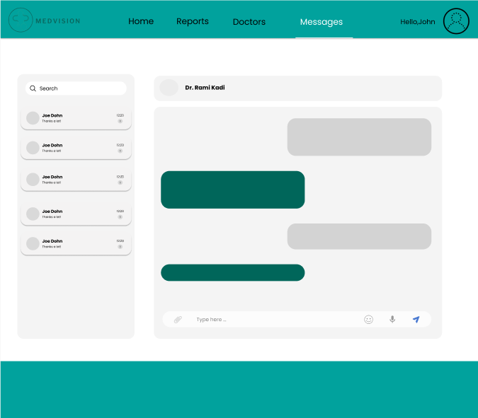
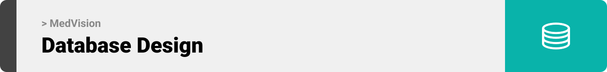

# MedVision


<br><br>

<!-- project philosophy -->


> MedVision aims to streamline the medical imaging analysis process by providing a user-friendly platform for doctors to upload, process, and analyze CT scans. We believe in enhancing the diagnostic experience by saving time, improving accuracy, and ensuring comprehensive patient care.


### User Stories

## Doctor
 
- As a doctor, I want to upload CT scans and use machine learning to detect cancer so that I can efficiently diagnose my patients.
- As a doctor, I want to view and manage my daily and weekly schedule so that I can keep track of my appointments and plan my day.
- As a doctor, I want to live chat with other doctors and patients so that I can collaborate with colleagues and communicate with patients in real time.

## Patient

- As a patient, I want to request an appointment with a doctor so that I can receive medical attention when needed.
- As a patient, I want to view the medical report uploaded by my doctor so that I can understand the results of my diagnosis.
- As a patient, I want to live chat with my doctor so that I can ask questions and get updates about my health in real time.

## Admin

- As an admin, I want to view a summary chart that displays statistics about doctors and patients so that I can monitor the overall activity of the platform.
- As an admin, I want to manage doctor and patient information so that I can keep the system updated and accurate.
- As an admin, I want to edit or delete user accounts so that I can maintain control over who can access the platform.

<br><br>

<!-- Tech stack -->


### MedVision is built using the following technologies:

- The backend is powered by [Laravel 11](https://laravel.com/), a PHP framework used to handle authentication, database management, and server-side logic.
- The frontend is developed using [React](https://reactjs.org/), a JavaScript library for building user interfaces
- [Node.js](https://nodejs.org/en) is used for implementing real-time chat functionality using [Socket.IO](https://socket.io/), enabling seamless communication between doctors and patients.
- [JWT](https://jwt.io/) is utilized for authentication and session management, ensuring secure access for users.
- The database is managed using [MYSQL](https://www.mysql.com/), providing reliable storage for patient and doctor information, reports, and appointments.
- Machine learning models are used to analyze CT scans uploaded by doctors to detect the presence of cancer, enabling advanced diagnostic capabilities.
- The live chat functionality between doctors and patients, as well as between doctors, is powered by [Node.js](https://nodejs.org/en) and [Socket.IO](https://socket.io/) for real-time communication.
- Admins can manage users and view detailed summaries of doctors and patients through a dedicated admin dashboard built using Laravel and React.

<br><br>

<!-- UI UX -->


> We designed MedVision using wireframes and mockups, iterating on the design until we reached the ideal layout for easy navigation and a seamless user experience.

- Project Figma design [figma](https://www.figma.com/design/aw2wDNWy383Ls7W9jvHdln/MedVision?node-id=0-1&node-type=canvas&t=CsQl6SbJJCzoHXqu-0)

### Mockups

| Doctor Dashboard                                    | Chats                            |
| --------------------------------------------------- | ----------------------------------------- | 
|  |  |

<br><br>

<!-- Database Design -->


###  Architecting Data Excellence: Innovative Database Design Strategies:


<br><br>

<!-- Implementation -->


### Doctor Screens (Web)

| Doctor Dashboard                               | Upload Page                            | Schedule Page                            |
| ------------------------------------------- | ----------------------------------------- | ----------------------------------------- |
|        |  |  |
| Patient Page                                | ChatPage                            | SignUp as a Doctor                          |
|  |  |    |


### Patient Screens (Web)

| Patient SignUp                               | Patient dashboard                             | Patient Report                        |
| ------------------------------------------- | ----------------------------------------- | ----------------------------------------- |
|  |  |  |
| Request Appointment                               | ChatPage                            | SignUp                          |
|  |  |    |


### Admin Screens (Web)

| Admin Dashboard                               | Doctor Page                              | Patient Page                        |
| ------------------------------------------ | --------------------------------------------- | ------------------------------------------ |
|  |  |  |

<br><br>


<!-- Prompt Engineering -->


###  Mastering AI Interaction: Unveiling the Power of Prompt Engineering:


- This project leverages advanced prompt engineering techniques to optimize interaction with deep learning models for cancer detection. The system uses a pre-trained [VGG16](https://www.geeksforgeeks.org/vgg-16-cnn-model/) model to analyze CT scan images and predict the likelihood of cancer. By carefully crafting the input data (in this case, images in base64 format), the system ensures that the model receives appropriately preprocessed data for accurate predictions.

- [TensorFlow](https://www.tensorflow.org/) is utilized to load and run the pre-trained model, while [Flask](https://flask.palletsprojects.com/en/3.0.x/) serves as the backend API for handling incoming image data and returning predictions. Additionally, [Flask-CORS](https://pypi.org/project/Flask-Cors/) is integrated to ensure seamless cross-origin communication between the frontend and backend.

- The cancer detection model processes CT scan images, classifies them, and returns a result indicating whether cancer is present. The model operates in real-time through a web-based API, providing fast and reliable diagnostic results to assist doctors in decision-making.

- By using [ngrok](https://ngrok.com/) to expose the local server to the internet, the system enables remote access to the prediction API, allowing users to submit images from anywhere for analysis. The model’s predictions are efficiently interpreted to determine whether the result is "Cancer" or "No Cancer."

- [Node.js](https://nodejs.org/en) and [Socket.IO](https://socket.io/) power the real-time live chat feature, enabling seamless communication between doctors and patients or between doctors themselves. The prompts within the chat are designed to maintain fluid and meaningful conversations, ensuring that both patients and doctors receive accurate and context-aware responses.

<br><br>

<!-- AWS Deployment -->


###  Efficient AI Deployment: Unleashing the Potential with AWS Integration:

- The frontend of this project is deployed on [Vercel](https://vercel.com/), ensuring high-performance delivery of the React application. Vercel provides automatic build and deployment pipelines directly from the GitHub repository, enabling fast and reliable updates for the user interface.

- The backend is deployed on an AWS EC2 instance, utilizing the scalability and flexibility of Amazon's cloud infrastructure. This instance hosts the Laravel-based API and machine learning model services, ensuring seamless processing of CT scan image data and returning predictions in real time.

<br><br>

<!-- Unit Testing -->


###  Precision in Development: Harnessing the Power of Unit Testing:

- While unit tests ensure the internal correctness of the system, Postman is used to manually test and validate API endpoints during development. By sending requests and reviewing the responses, we ensure that the Laravel backend API handles authentication, data retrieval, and communication processes correctly.

- Postman helps verify the accuracy of key endpoints, including those handling CT scan image uploads, cancer predictions, report generation, and appointment management. It also ensures that Socket.IO-based communication for real-time chat functions as intended.

- This manual testing method is particularly useful for checking the integration between the frontend and backend, making sure that responses match expected behavior under different conditions before deploying to production.


<br><br>


<!-- How to run -->


> To set up MedVision locally, follow these steps:

### Prerequisites

Ensure you have the following installed before setting up MedVision:
* **npm** (Node.js package manager)
  ```sh
  npm install npm@latest -g
   ```
* **Composer** (for Laravel dependencies)
  ```sh
  composer install  
   ``` 
* **MySQL** (or any other database you plan to use)

### Installation

> Follow these steps to install and set up MedVision locally:

1. Clone the repo
   git clone [github](https://github.com/Nibalab/MedVision.git)

2. Install NPM packages
   ```sh
   npm install
   ```
3. Install PHP dependencies (for the Laravel backend)  
    ```sh
   composer install
   ``` 
4. Set up environment variables:
  * Copy .env.example to .env for both the frontend and backend and fill in your details (API keys, database credentials, etc.).

5. Generate the application key for Laravel 
     ```sh
  php artisan key:generate
   ```  
6. Run migrations to set up the database 
    ```sh
  php artisan migrate
   ```   
7. Run the backend
   ```sh
  php artisan serve
   ``` 
8. Run the frontend
   ```sh
  npm start
   ``` 
9. Live chat setup: Ensure that Node.js and Socket.IO are properly set up and running for real-time communication features.
   * Start the Socket.IO server (located in the Node.js server folder):   
       ```sh
  node server.js
   ``` 
Now, you should be able to run Coffee Express locally and explore its features.         