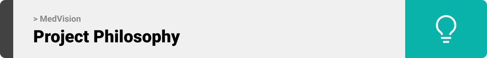

# MedVision

  

<!-- project philosophy -->

> MedVision aims to streamline the medical imaging analysis process by providing a user-friendly platform for doctors to upload, process, and analyze CT scans. We believe in enhancing the diagnostic experience by saving time, improving accuracy, and ensuring comprehensive patient care.

### User Stories

## Doctor
 
- As a doctor, I want to upload CT scans and use machine learning to detect cancer so that I can efficiently diagnose my patients.
- As a doctor, I want to view and manage my daily and weekly schedule so that I can keep track of my appointments and plan my day.
- As a doctor, I want to live chat with other doctors and patients so that I can collaborate with colleagues and communicate with patients in real time.

## Patient

- As a patient, I want to request an appointment with a doctor so that I can receive medical attention when needed.
- As a patient, I want to view the medical report uploaded by my doctor so that I can understand the results of my diagnosis.
- As a patient, I want to live chat with my doctor so that I can ask questions and get updates about my health in real time.

## Admin

- As an admin, I want to view a summary chart that displays statistics about doctors and patients so that I can monitor the overall activity of the platform.
- As an admin, I want to manage doctor and patient information so that I can keep the system updated and accurate.
- As an admin, I want to edit or delete user accounts so that I can maintain control over who can access the platform.

  

<!-- Tech stack -->

### MedVision is built using the following technologies:

- The backend is powered by [Laravel 11](https://laravel.com/), a PHP framework used to handle authentication, database management, and server-side logic.
- The frontend is developed using [React](https://reactjs.org/), a JavaScript library for building user interfaces
- [Node.js](https://nodejs.org/en) is used for implementing real-time chat functionality using [Socket.IO](https://socket.io/), enabling seamless communication between doctors and patients.
- [JWT](https://jwt.io/) is utilized for authentication and session management, ensuring secure access for users.
- The database is managed using [MYSQL](https://www.mysql.com/), providing reliable storage for patient and doctor information, reports, and appointments.
- Machine learning models are used to analyze CT scans uploaded by doctors to detect the presence of cancer, enabling advanced diagnostic capabilities.
- The live chat functionality between doctors and patients, as well as between doctors, is powered by [Node.js](https://nodejs.org/en) and [Socket.IO](https://socket.io/) for real-time communication.
- Admins can manage users and view detailed summaries of doctors and patients through a dedicated admin dashboard built using Laravel and React.

  

<!-- UI UX -->

> We designed MedVision using wireframes and mockups, iterating on the design until we reached the ideal layout for easy navigation and a seamless user experience.

- Project Figma design [figma](https://www.figma.com/design/aw2wDNWy383Ls7W9jvHdln/MedVision?node-id=0-1&node-type=canvas&t=CsQl6SbJJCzoHXqu-0)

### Mockups

| Doctor Dashboard                                    | Chats                            |
| --------------------------------------------------- | ----------------------------------------- | 
|  |  |

  

<!-- Database Design -->

###  Architecting Data Excellence: Innovative Database Design Strategies:

  

<!-- Implementation -->

### Doctor Screens (Web)

| Doctor Dashboard                               | Upload Page                            | Schedule Page                            |
| ------------------------------------------- | ----------------------------------------- | ----------------------------------------- |
|        |  |  |
| Patient Page                                | ChatPage                            | SignUp as a Doctor                          |
|  |  |    |

### Patient Screens (Web)

| Patient SignUp                               | Patient dashboard                             | Patient Report                        |
| ------------------------------------------- | ----------------------------------------- | ----------------------------------------- |
|  |  |  |
| Request Appointment                               | ChatPage                            | SignUp                          |
|  |  |    |

### Admin Screens (Web)

| Admin Dashboard                               | Doctor Page                              | Patient Page                        |
| ------------------------------------------ | --------------------------------------------- | ------------------------------------------ |
|  |  |  |

  

<!-- Prompt Engineering -->

###  Mastering AI Interaction: Unveiling the Power of Prompt Engineering:

- This project leverages the power of prompt engineering to optimize interactions within the system, particularly when detecting cancer using machine learning. By carefully designing the input data and instructions, the model's performance is fine-tuned for enhanced accuracy in diagnosing cancer from CT scans.
- Additionally, in the live chat feature, prompt engineering plays a crucial role in ensuring that doctor-patient interactions are seamless, delivering context-aware and meaningful responses. The system efficiently guides doctors and patients through complex conversations, enhancing communication and improving overall user experience.
- The prompt structure enables personalized and task-specific responses, which leads to higher precision in generating reports, answering questions, and handling appointments in the doctor-patient communication loop.

  

<!-- AWS Deployment -->

###  Efficient AI Deployment: Unleashing the Potential with AWS Integration: